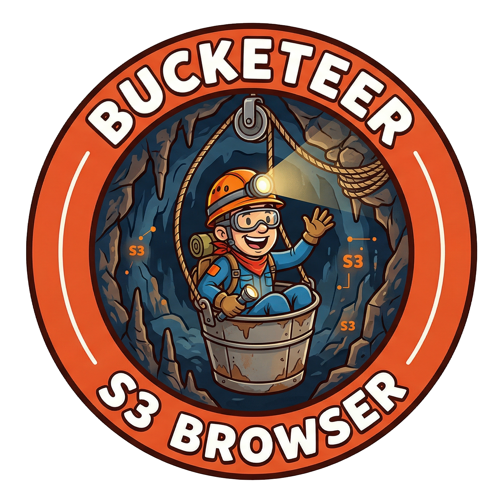
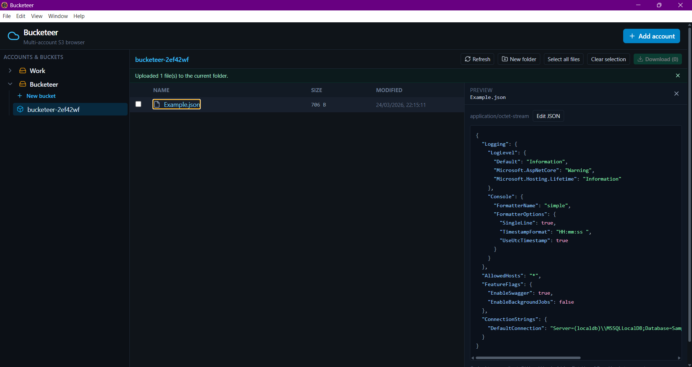

<p align="center">
  
</p>

# Bucketeer

**A fast, native-feeling desktop client for Amazon S3—built for people who live in buckets.**

Stop juggling browser tabs, AWS Console quirks, and one-off scripts just to move files between accounts. Bucketeer is a **free, open-source Electron app** that puts **multiple AWS accounts**, **per-region credentials**, and **real filesystem workflows** (drag in, pick a folder out) in one place.

<p align="center">
  
</p>

---

## Why developers reach for Bucketeer

| You want… | Bucketeer gives you… |
|-----------|----------------------|
| **Several AWS profiles in one UI** | Add labeled accounts (dev, staging, prod, client A…) and expand each to its buckets. |
| **S3 that behaves like folders** | Prefix navigation with `/` delimiter, breadcrumbs, and empty “folder” markers—without pretending S3 is POSIX. |
| **Bulk download without scripting** | Multi-select objects, choose a destination directory, preserve key paths under the hood. |
| **Quick uploads** | Drag files from the OS onto the current prefix, or use the upload flow—keys follow `prefix + basename`. |
| **Inspect JSON instantly** | Click a file name to open a lazy-loaded right-side preview pane (separate from checkbox selection), with safe size limits to keep the app responsive. |
| **Credentials that stay on your machine** | Access keys are stored in Electron’s **user data** directory as local JSON—not sent to a third-party backend. |
| **A codebase you can fork** | TypeScript end-to-end, **AWS SDK for JavaScript v3**, IPC through a typed preload bridge—no magic. |

If you’ve ever thought *“I just need Cyberduck, but S3-native and hackable”*—you’re in the right repo.

---

## Features

- **Multi-account sidebar** — Expand/collapse per account; lazy-load buckets when you open an account.
- **Bucket operations** — List buckets; create buckets with correct **LocationConstraint** handling (`us-east-1` vs other regions).
- **Object browser** — Folder-style listing (common prefixes + objects at the current level), size and last-modified columns, human-readable byte formatting.
- **Navigation** — Click folders and breadcrumb segments to move through prefixes.
- **Selection & download** — Checkbox multi-select; native folder picker for downloads; nested keys written to matching subpaths on disk.
- **Upload** — Upload one or many files into the active prefix; drag-and-drop supported.
- **JSON preview pane** — Click a file name (not the checkbox) to open a right-side preview panel; content is fetched lazily and capped at 512 KB for performance safety.
- **New folder** — Creates the usual S3 “folder” object (`key/`).
- **Rename object** — Copy-to-new-key + delete-original (same parent prefix); surfaces partial-failure if delete fails after copy.
- **Account management** — Add, remove, and inline-edit friendly **labels**; update keys/regions as needed.
- **Scales past 1000 objects** — Folder listings automatically follow S3 continuation tokens, so large prefixes load completely.

---

## Architecture (for contributors)

- **Electron main process** — Owns AWS clients (`@aws-sdk/client-s3`), file dialogs, streams for upload/download, and account persistence.
- **Preload** — Exposes a minimal `window.bucketeer` API via `contextBridge`; **context isolation on**, **Node integration off** in the renderer.
- **Renderer** — React 18 + TypeScript + Tailwind CSS + Lucide icons; talks only through the preload contract (`src/shared/api.ts` mirrors the surface).

S3 calls are made with **cached `S3Client` instances** per account/region/key tuple so repeated navigation stays snappy.

### Preview safety model

- JSON preview is **lazy-loaded** only when you click a file name in the object list.
- The renderer performs a quick size gate (512 KB) from listing metadata to avoid unnecessary preview fetches.
- The main process enforces the same cap with an S3 byte-range request (`bytes=0-524287`) so large objects are never fully downloaded for preview.
- Preview content is written to a temporary OS path for read-only display today, and to keep future in-pane editing/save flows straightforward.

---

## Security & privacy

- Credentials are stored in **`accounts.json`** under the app’s user data path (platform-specific; Electron `app.getPath('userData')`).
- There is **no** separate Bucketeer cloud service—traffic is between your machine and **AWS S3** only.
- Use **least-privilege IAM** (e.g. scoped policies for specific buckets/prefixes) for everyday work; rotate keys if they’re ever exposed.

---

## Requirements

- **Node.js** 18+ (recommended: current LTS)
- **npm** (ships with Node)
- **AWS access key** with permissions for the S3 operations you need (and the correct **region** per account)

---

## Quick start

```bash
git clone https://github.com/liamwhan/Bucketeer.git
cd Bucketeer
npm install
npm run dev
```

The app opens in development mode with hot reload via **electron-vite**.

### Production build (from source)

```bash
npm run build
npm run preview
```

Installers (NSIS `.exe`, `.dmg`, `.AppImage`) are produced with **`npm run dist`** (or the same steps the **Release** GitHub Action runs: `npm run build`, `npm run icons`, `electron-builder`). Pushing a tag **`v*`** whose suffix matches **`package.json`** `version` builds all platforms and publishes a GitHub Release. The packaged app entry remains `out/main/index.js` after `npm run build`.

---

## Project layout

```
src/
  main/           # Electron main — IPC, S3 service, account store
  preload/        # contextBridge API
  renderer/src/   # React UI (App.tsx)
  shared/         # Types + API shape shared across layers
```

---

## Known limitations

These are intentional transparency, not excuses—they’re great **first PR** opportunities:

- **Rename** — Implemented as single **CopyObject** + **DeleteObject**; objects **over 5 GB** would need multipart copy (not implemented).
- **Upload** — Files only (not recursive directory upload); folder drops are not a full tree mirror.

---

## Tech stack

| Layer        | Choice |
|-------------|--------|
| Desktop     | [Electron](https://www.electronjs.org/) |
| Build       | [electron-vite](https://electron-vite.org/) + [Vite](https://vitejs.dev/) |
| UI          | [React](https://react.dev/) 18 |
| Styling     | [Tailwind CSS](https://tailwindcss.com/) |
| Icons       | [Lucide](https://lucide.dev/) |
| AWS         | [AWS SDK for JavaScript v3](https://docs.aws.amazon.com/sdk-for-javascript/v3/developer-guide/) — `@aws-sdk/client-s3` |
| Language    | TypeScript |

---

## Contributing

Issues and PRs are welcome—whether that’s **packaging**, **S3-compatible endpoints**, or **UI polish**. Please keep changes focused and consistent with existing patterns (typed IPC, small main-process surface).

---

## License

[MIT](LICENSE) © Liam Whan

---

**Bucketeer** — *Your buckets, your machine, your keys.*
